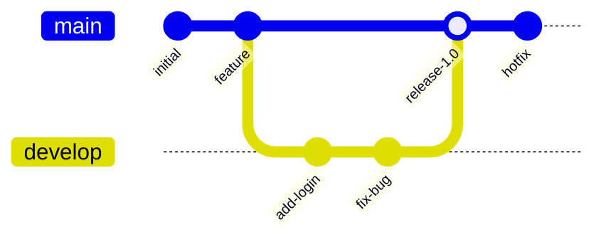
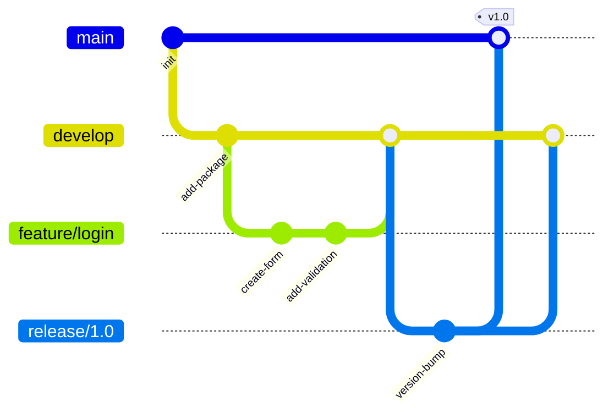
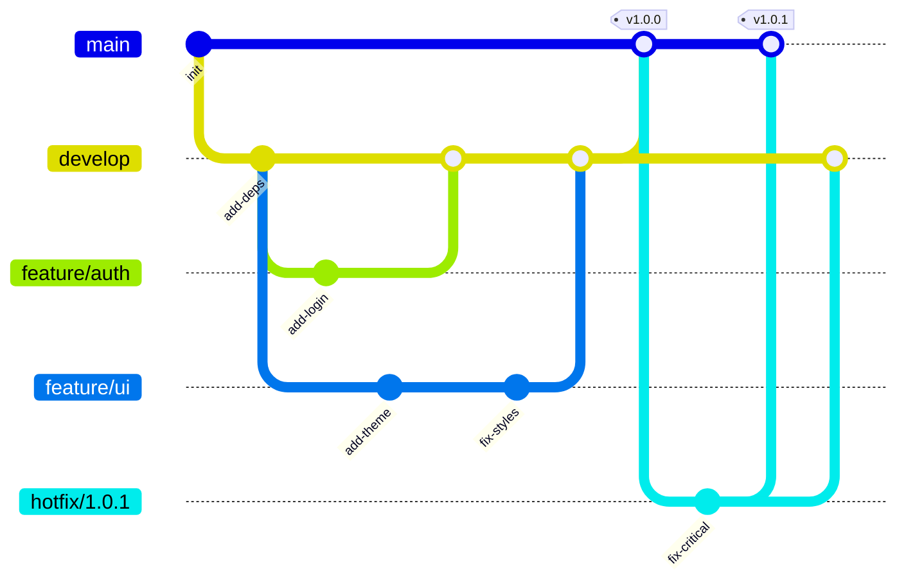
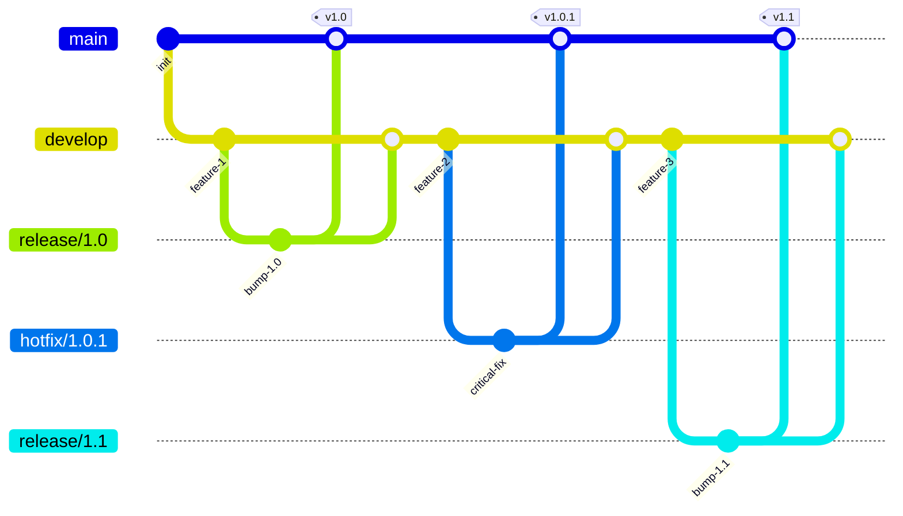

# Git Fundamentals y Estrategias Avanzadas

## 1. Git Fundamentals

### 1.1 Configuración Inicial de Git

```bash
# Configuración básica de identidad
git config --global user.name "Tu Nombre"
git config --global user.email "tu@email.com"

# Configuración de editor predeterminado
git config --global core.editor "code --wait"  # Para VS Code

# Configuración de main como rama principal
git config --global init.defaultBranch main

# Configuración de herramienta de merge
git config --global merge.tool vscode
```


### 1.2 Comandos Básicos

#### Inicialización y Clonación
```bash
# Iniciar nuevo repositorio
git init

# Clonar repositorio existente
git clone <url_repositorio>
git clone <url_repositorio> <directorio_destino>
```

#### Gestión de Cambios

"Tracker" los archivos
añadir cualquier archivo nuevo
preparar dichos archivos
upload to github

git add `<FILE>` -> git commit "commit" -> git push

```bash
# Ver estado del repositorio
git status

# Añadir archivos al staging area
git add <archivo>          # Archivo específico
git add .                  # Todos los archivos
git add *.js              # Por patrón

# Crear commit
git commit -m "mensaje"    # Commit con mensaje
git commit -am "mensaje"   # Add + commit para archivos tracked

# Ver historial
git log                    # Historial completo
git log --oneline         # Formato resumido
git log --graph           # Visualización gráfica
```

#### Sincronización con Remoto
```bash
# Gestión de remotos
git remote add origin <url>
git remote -v             # Ver remotos configurados

# Sincronización
git push origin main      # Enviar cambios
git pull origin main      # Obtener cambios
git fetch origin          # Obtener referencias sin merge

# Ver diferencias
git diff                  # Cambios en working directory
git diff --staged         # Cambios en staging area
git diff main..feature    # Entre ramas
```


### 1.3 Gestión de Ramas

#### Operaciones Básicas
```bash
# Crear y cambiar ramas
git branch <nombre>       # Crear rama
git checkout <nombre>     # Cambiar a rama
git checkout -b <nombre>  # Crear y cambiar
git switch <nombre>       # Cambiar (Git moderno)

# Merge de ramas
git merge <rama>          # Merge de rama actual
git merge --no-ff <rama>  # Merge sin fast-forward

# Rebase
git rebase main          # Rebase sobre main
git rebase -i HEAD~3     # Rebase interactivo
```

#### Resolución de Conflictos
```bash
# Ver archivos en conflicto
git status

# Después de resolver manualmente
git add <archivo_resuelto>
git commit -m "Resolución de conflicto"

# Abortar merge/rebase
git merge --abort
git rebase --abort
```

## 2. Branching Strategies

### 2.1 Git Flow
- **Ramas principales**:
  - `main`: código en producción
  - `develop`: desarrollo activo
- **Ramas de soporte**:
  - `feature/*`: nuevas características
  - `release/*`: preparación de releases
  - `hotfix/*`: correcciones urgentes
- **Flujo**:
  1. Feature branches desde develop
  2. Release branches para preparar versión
  3. Hotfix branches desde main



### 2.2 GitHub Flow
- Modelo más simple
- Solo una rama principal (`main`)
- Feature branches para todo desarrollo
- Pull Requests como mecanismo central
- Deploy después de merge a main

### 2.3 Trunk Based Development
- Desarrollo directo en `main`
- Ramas cortas y pequeñas
- Integración continua frecuente
- Feature flags para código incompleto
- Release branches solo si necesario

### 2.4 Feature Branch Workflow
- Feature branch por cada tarea
- Nombres descriptivos: `feature/user-auth`
- Merge mediante Pull Request
- Code review obligatorio
- Eliminar rama después de merge

### 2.5 Release Management
- **Versionado semántico**: MAJOR.MINOR.PATCH
- Tags para marcar releases: `v1.2.3`
- Release branches para mantenimiento
- Hotfixes aplicados a todas las versiones afectadas


## 3. Code Review

### 3.1 Mejores Prácticas

#### Tamaño de PRs
- Máximo 400 líneas por PR
- Un solo propósito por PR
- Dividir cambios grandes en PRs pequeños
- Incluir tests relevantes

#### Descripción y Documentación
```markdown
# Título descriptivo

## Cambios realizados
- Lista de cambios principales
- Impacto en otras áreas

## Cómo probar
1. Pasos específicos
2. Casos de prueba

## Screenshots (si aplica)
```

#### Conventional Commits
```
<tipo>[alcance opcional]: <descripción>

[cuerpo opcional]

[nota de pie opcional]
```
- Tipos: feat, fix, docs, style, refactor, test, chore
- Ejemplo: `feat(auth): add OAuth2 support`

### 3.2 Proceso de Revisión

#### Qué Buscar
1. **Funcionalidad**
   - Cumple requerimientos
   - Maneja errores
   - Edge cases

2. **Código**
   - Claridad y mantenibilidad
   - Patrones de diseño
   - Performance

3. **Tests**
   - Cobertura adecuada
   - Casos relevantes
   - Tests unitarios/integración

#### Cómo Dar Feedback
- Ser específico y constructivo
- Sugerir mejoras concretas
- Usar un tono positivo
- Sepa